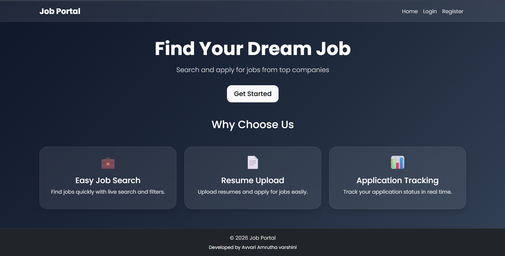
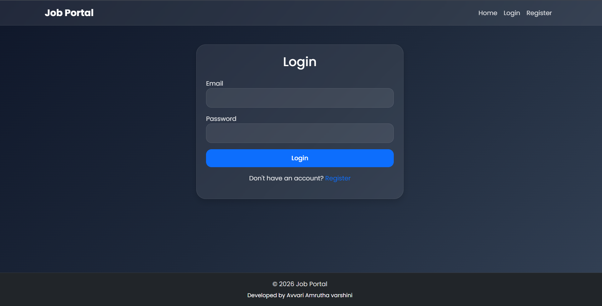
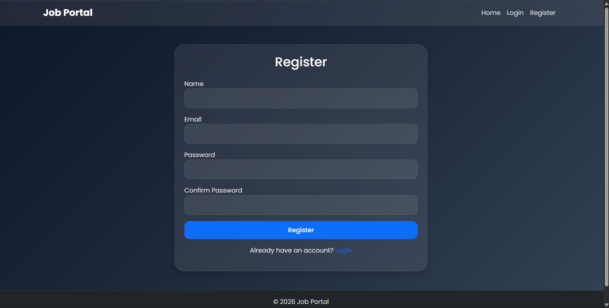
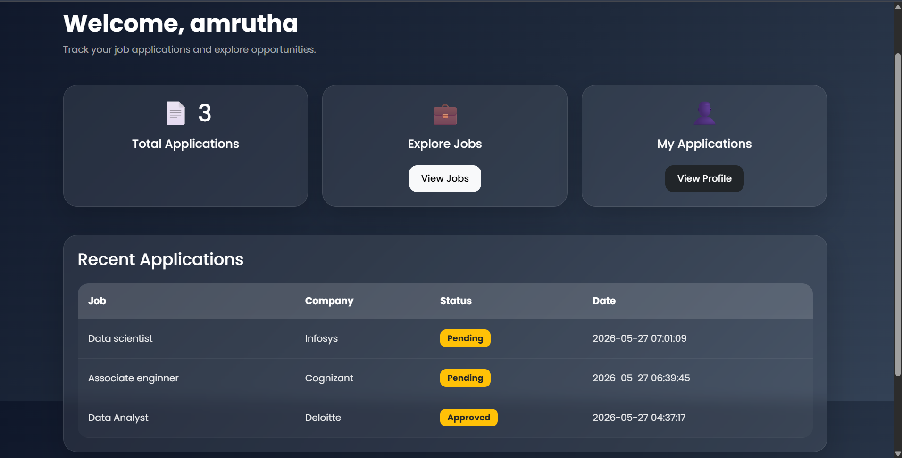
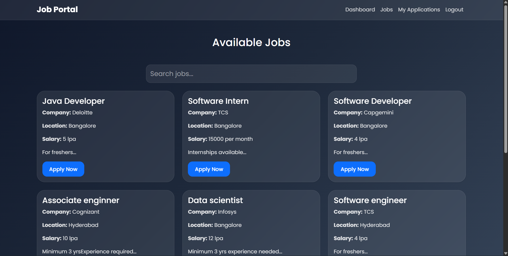
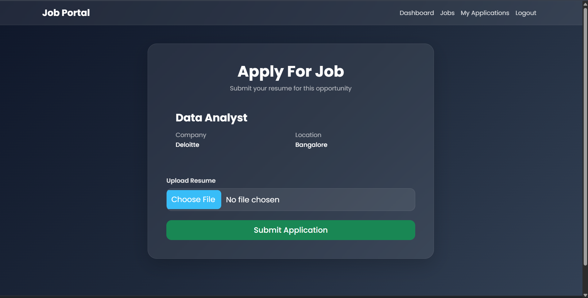
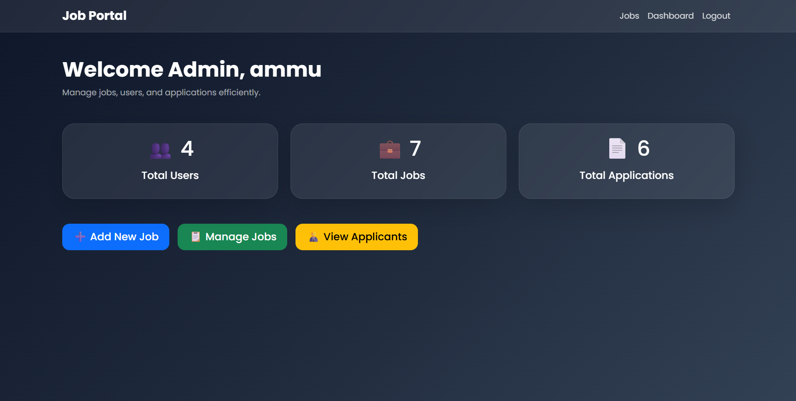
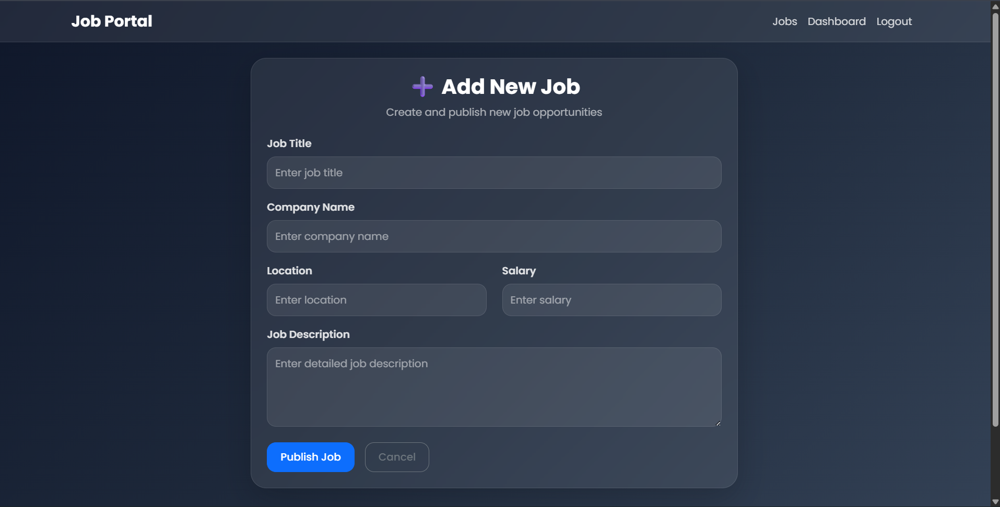
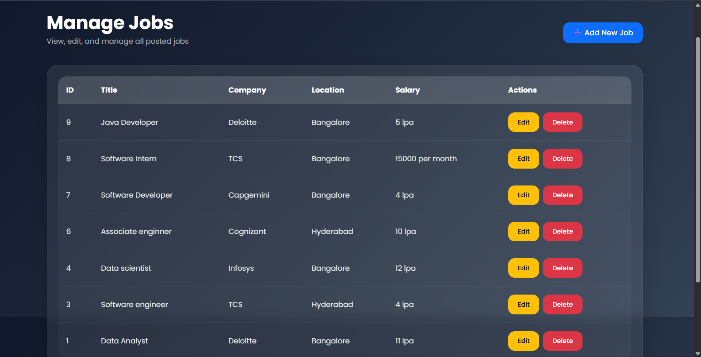
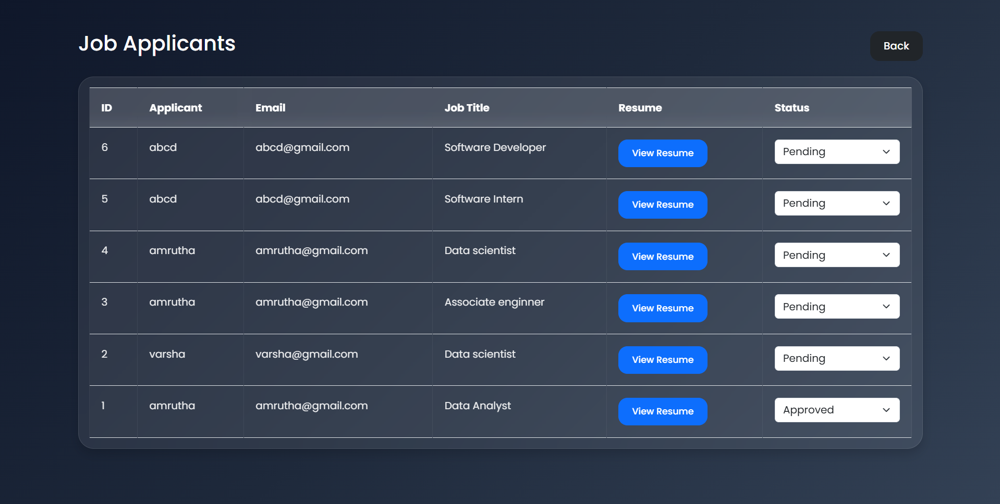

# Job Portal System

A full-stack Job Portal web application developed using PHP, MySQL, HTML5, CSS3, Bootstrap 5, JavaScript, Git/GitHub, XAMPP, MySQL Workbench, InfinityFree Hosting.  
This project allows users to search and apply for jobs, while administrators can manage job postings and applicants through an admin dashboard.

---

# Live Demo

https://amruthajobportal.infinityfreeapp.com

---

# GitHub Repository

https://github.com/AmruthavarshiniAvvari/job-portal-system

---

# Features

## User Features
- User Registration & Login
- Secure Authentication
- Browse Available Jobs
- Search Jobs
- Apply for Jobs
- Upload Resume
- View Applied Jobs
- Responsive User Dashboard

---

## Admin Features
- Admin Login
- Admin Dashboard
- Add New Jobs
- Edit Jobs
- Delete Jobs
- View Applicants
- Manage Job Listings

---

# Technologies Used

## Frontend
- HTML5
- CSS3
- Bootstrap 5
- Glassmorphism UI Design
- JavaScript

---

## Backend
- PHP

---

## Database
- MySQL

---

## Hosting & Deployment
- InfinityFree
- GitHub

---

# Project Structure

```plaintext
job-portal/
│
├── admin/
├── assets/
│   ├── css/
│   ├── js/
│   └── images/
│
├── config/
├── includes/
├── uploads/
│
├── index.php
├── login.php
├── register.php
├── dashboard.php
├── jobs.php
├── apply.php
├── profile.php
├── logout.php
└── search.php
```

---

# Database Tables

- users
- jobs
- applications

---

# Screenshots

## Home Page


---

## Login Page


---

## Register Page


---

## User Dashboard


---

## Available Jobs


---

## Apply Job


---

## Admin Dashboard


---

## Add Job By Admin


---

## Manage Jobs


---

## View Applicants


---

# Installation Steps

## 1. Clone Repository

```bash
git clone https://github.com/AmruthavarshiniAvvari/job-portal-system.git
```

---

## 2. Import Database

Import:

```plaintext
job_portal.sql
```

into MySQL using phpMyAdmin or MySQL Workbench.

---

## 3. Configure Database

Update:

```plaintext
config/db.php
```

with your MySQL credentials.

---

## 4. Run Project

Place project inside:

```plaintext
htdocs
```

folder and run Apache & MySQL using XAMPP.

Open:

```plaintext
http://localhost/job-portal
```

---

# Demo Credentials

## Admin Login

Email: ammu@gmail.com  
Password: 3805

## User Login

Users can register normally from the website.

---

# Author

## Avvari Amrutha varshini

---

# License

This project is developed for educational and internship purposes.
